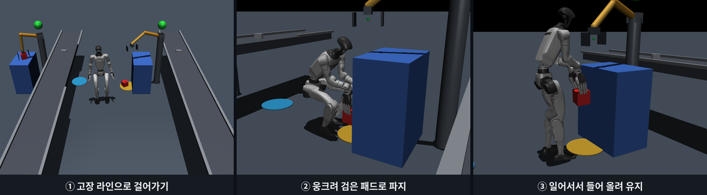
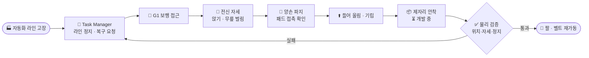
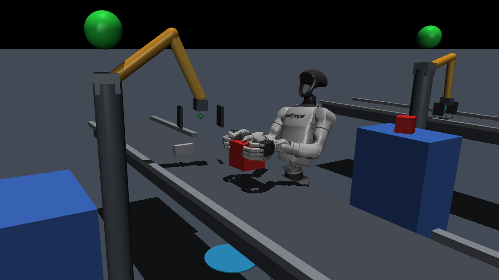
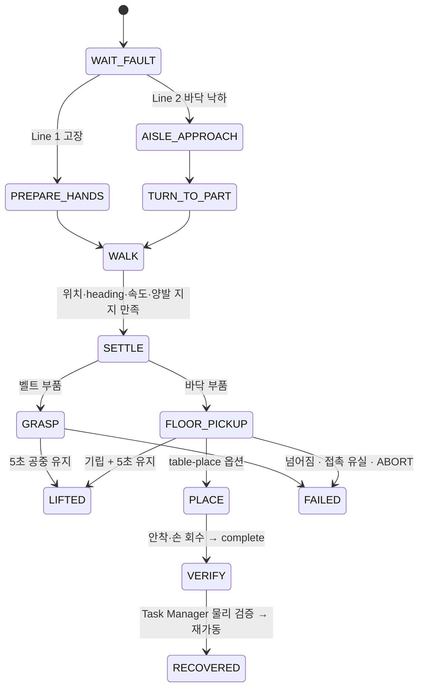
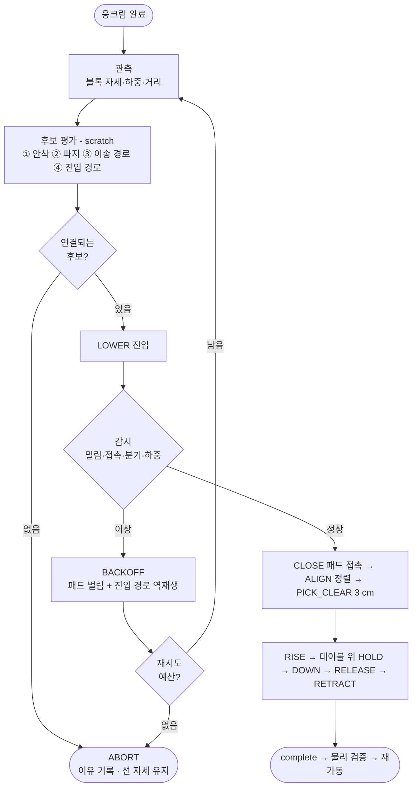
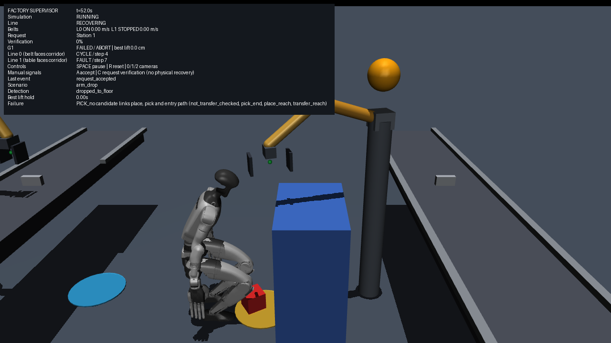

# 🤖 Humanoid Factory Supervisor — 공장 고장을 찾아가 전신으로 복구하는 휴머노이드

> **정상 생산은 자동화 팔·컨베이어가, 예외 상황 복구는 휴머노이드가.**
> MuJoCo 공장에서 Unitree G1이 고장 난 작업 셀로 **걸어가**, **앉고 서며 양손으로** 떨어지거나 걸린 부품을 복구합니다.

<p align="center">
  
</p>
<p align="center"><sub>Line 2 실제 실행 (seed 0) · 자동화 팔이 부품을 바닥에 떨어뜨림 → G1이 걸어가서 → 무릎을 벌려 웅크리고 손가락 끝 패드로 집어 → 일어서서 5초 유지</sub></p>

### ⚡ 한눈에 보기

| 항목 | 내용 |
|---|---|
| 🦾 로봇 | **Unitree G1** (다리 12 · 허리 3 · 팔 14) + **Sharpa Wave** 5지 양손 (손당 22 액추에이터) |
| 🏭 공장 | 라인 2개 · 각 라인에 컨베이어 + 자동화 팔 + 테이블 · 고장 주입과 Task Manager |
| 🧪 시뮬레이터 | MuJoCo 3.12 · 물리 2 ms · 제어 100 Hz |
| 🚶 보행 | Unitree 사전학습 G1 보행 정책(외부 도구) + 정밀 접근 제어 |
| 🔒 원칙 | 로봇은 **액추에이터 명령으로만** 움직입니다 — 물체 부착·순간이동·숨은 힘·충돌 끄기·성공 기준 완화 없음 |

### 🚦 현재 상태 (2026-09-28, seed 0)

| 복구 시나리오 | 상태 | 핵심 실측 |
|---|:---:|---|
| **Line 1** 벨트 걸림 → 걸어가서 양손으로 들어 올려 5초 유지 | ✅ | 4934 step · 79.5 mm 상승 |
| **Line 2** 바닥 낙하 → 걸어가서 앉아 집고 일어서서 5초 유지 | ✅ | 8760 step · 601.7 mm 상승 |
| **Line 2** 같은 동작을 **검은 패드 + 무릎 벌림**으로 (실험 옵션) | ✅ | 9576 step · 438 mm · 유지 하중 100% 패드 |
| **Line 2** 바닥 → **테이블 안착** → 손 회수 → 복구 검증 → **라인 재가동** | ⏳ | 판단 루프 동작 · 물리 경로 미확보 ([이유](#-결과와-한계-results--limitations)) |
| 블록을 든 채 걷기 | ❌ | 블록 없이 팔만 앞으로 든 시험에서 기존 보행이 명령을 추종 못 함 (실제 운반은 미시험) |



---

## 📌 주요 기능 (Key Features)

### 1. 고장 주입 공장과 "물리로 확인하는" 복구 검증 (Factory & Verification)

- **두 라인, 두 고장**: 1.3 m 통로 양쪽에 독립 라인이 있습니다. **Line 1**은 벨트 위 부품 걸림(`jam`), **Line 2**는 자동화 팔이 부품을 테이블 밖 **바닥에 떨어뜨리는** 고장(`arm_drop`)입니다.
- **복구 요청 흐름**: 고장이 나면 Task Manager가 해당 라인을 멈추고 G1을 호출합니다. G1이 요청을 수락(`accept`)하면 복구 중(`RECOVERING`) 상태가 됩니다.
- **신호만으로는 재가동하지 않음**: G1이 "완료"를 보내도, 부품이 지정 위치 **60 mm 이내**, 기울기 **0.15 rad 미만**, yaw **±0.15 rad**(정육면체라 90° 대칭), 작업면 접촉, **정지 상태**를 **50 tick 연속** 만족해야만 팔을 리셋하고 벨트를 다시 돌립니다. 재가동 직전에도 다시 확인합니다.
- **보행 채점 기준(Navigation Gate)**: 위치 0.10 m · heading 0.15 rad · 1초 유지 · 넘어짐/금지 접촉 없음 · 올바른 셀 먼저 · 1500 step 이내. step당 0.05 m 넘는 base 이동은 **순간이동으로 실격**입니다.

### 2. 보행 접근 (Walk & Precision Approach)

- **사전학습 보행 정책**: 다리는 Unitree G1 보행 정책(BSD-3)이 담당합니다. 보행은 연구 대상이 아니라 주어진 도구입니다.
- **정밀 접근**: 부품 기준 목표 자세까지 오차에 비례한 속도 명령을 내고, **위치·heading·속도·양발 지지**를 모두 만족할 때만 서 있는 자세로 넘겨받습니다.
- **통로 우회 + 제자리 회전**: Line 2는 통로 중앙으로 먼저 이동하고, 빈 공간에서 방향을 튼 뒤 부품으로 접근합니다.

### 3. Line 1 — 선 채로 양손 파지 (Standing Bimanual Grasp)

<p align="center"></p>

- **연속 접근 궤적**: 걸으면서 들고 온 팔 자세에서 곧바로 블록 양옆으로 손을 가져갑니다.
- **접촉 후 squeeze + 재IK**: 양손을 3 mm씩 더 모으고, 실제 관절값에서 IK를 다시 풀어 1 cm/s로 들어 올립니다. 접촉 후 MuJoCo `noslip_iterations=10`으로 미끄럼 creep를 줄입니다.

### 4. Line 2 — 바닥 부품 줍기 (Floor Pickup)

- **전신 자세 IK(WholeBodyPosture)**: 발을 바닥에 고정한 채 다리·허리·팔을 함께 풀어 **무게중심을 발 위에** 유지합니다. 경계 제약 최소제곱(BVLS)으로 관절 한계를 지키고, 계획용 모델에만 8 mm 자기충돌 여유를 둡니다(실제 물리 모델은 변경하지 않음).
- **엄지를 접는 바닥 집기**: 앉을 때는 엄지를 접어 두고, 손을 내리는 후반에 네 손가락을 폅니다.
- **검은 패드 + 무릎 벌림(`--pad-grip --frog-stance`)**: 손가락 끝의 elastomer 패드 면으로 블록 옆면을 잡습니다. 발끝을 돌리고 무릎을 벌려(무릎 폭 약 22 → 39 cm) 팔이 지나갈 길을 만듭니다.
  - 일어설 때 손 목표를 **실제 어깨 좌표계**에서 추종하고, **명령 손 위치**를 기준으로 서보해 squeeze를 유지합니다.
  - 패드 힘 측정에서는 단단한 손가락 껍질의 접촉력을 **제외**합니다. 껍질로 받친 것을 패드 파지로 세지 않습니다.

### 5. 관측 → 선택 → 실행 → 검증 → 재계획 루프 (Closed-Loop Recovery, `--table-place`)

바닥 블록을 테이블 지정 위치까지 옮기는 전체 복구를 위해, 기존 복구 FSM은 그대로 두고 그 둘레에 **폐루프 판단 구조**를 붙였습니다. LLM이나 외부 API는 쓰지 않으며, 선택 담당은 교체 가능한 인터페이스로 분리했습니다.

- **관측(Observe)**: 블록의 실제 위치·방향·속도, 몸 기울기, 양발 하중, 패드 하중, 손–다리 거리, 계획 오차를 읽습니다.
- **후보 평가(Evaluate)**: 실제 상태를 **복사한 scratch 데이터**에서 파지 계획 후보마다 아래 연결을 차례로 확인합니다. **끝점만이 아니라 경로 전체**를 봅니다.

  | 검사 | 확인 내용 |
  |---|---|
  | ① 안착 도달 | 발을 고정한 채 테이블 위 목표에 손이 닿는가 |
  | ② 파지 자세 | 웅크린 자세에서 블록 옆면에 패드가 닿는가 |
  | ③ 이송 경로 | 들어 올려 테이블 앞면을 넘겨 내려놓는 길 전체가 관절 한계 안인가 |
  | ④ 진입 경로 | 손이 무릎·블록에 닿거나 팔 해가 갑자기 뒤집히지 않는가 |

- **허용치 보정**: 경로 허용치는 이미 **물리적으로 성공한 진입 경로**를 같은 검사기로 결정 때마다 측정해 정합니다.
- **선택(Select)**: 모든 연결이 되는 후보만 고르고, 없으면 **이유를 붙여 제어된 중단(ABORT)** 을 합니다.
- **실행 중 감시(Verify)**: 블록이 밀리거나 돌면, 손이 다리를 계속 밀면, 계획 팔 자세가 급변하면, 패드 하중이 안 생기면 실패로 봅니다.
- **재계획(Replan)**: 이미 안정하게 지나온 **진입 경로를 거꾸로 되감아** 물러납니다. 그다음 블록을 다시 관측하고, 실패한 계획을 빼고 재선택합니다(최대 3회).
- **기록**: 판단마다 관측값, 후보별 탈락 이유, 선택과 근거, 실행 결과를 남깁니다. 뷰어는 종료 시 이를 출력합니다.

### 6. 재현성과 회귀 보호 (Reproducibility)

- **비트 단위 회귀 확인**: 새 기능은 옵션으로만 켜집니다. 변경 전후 기본 경로의 궤적(qpos·qvel·ctrl)을 매 tick 비교해 같음을 확인합니다.
- **데모 기록과 재생**: 25차원 action만이 아니라 preshape·엄지 명령과 solver 설정까지 포함한 **완전한 명령**을 기록합니다. Expert 없이 저장된 명령만 실행해 **1e-6 이내로 재현**됩니다.

---

## 🛠️ 시스템 설계 (System Architecture)

### 전체 구조

시스템은 **Perception(상태 읽기)** · **Decision(판단)** · **Control(제어)** 세 파트로 구성됩니다.

1. **Perception**: 카메라 대신 시뮬레이터의 실제 상태를 읽습니다. 부품 자세, 접촉 힘(패드/껍질 분리), 발 하중, 몸 기울기를 씁니다.
2. **Decision**: `FactoryRecovery`가 미션 FSM(고장 대기 → 접근 → 파지 → 들어 올림 → 안착 → 검증)을 총괄합니다. Line 2 테이블 경로에서는 `recovery_agent`가 후보를 평가·선택합니다.
3. **Control**: 다리는 보행 정책 또는 전신 자세 IK가, 팔은 IK·resolved-rate 서보가, 손은 손가락 그룹 시너지 명령이 맡습니다.

### 계층 구조

```
┌──────────────────────────────────────────────────────────────────┐
│  FactoryEnv  (envs/factory_env.py)                                │
│   두 라인 · 컨베이어 · scripted 자동화 팔 · 고장 주입 · Task Manager   │
└──────────────────────────────┬───────────────────────────────────┘
                               │ fault → accept / complete(검증 후 재가동)
┌──────────────────────────────▼───────────────────────────────────┐
│  FactoryRecovery  (expert/factory_recovery.py)   미션 FSM          │
│   WAIT_FAULT → AISLE/TURN/WALK → SETTLE → GRASP | FLOOR_PICKUP     │
│   → (CARRY) → PLACE → VERIFY → RECOVERED                          │
└──────┬───────────────────────┬──────────────────────┬────────────┘
       │ 보행                   │ Line 1                │ Line 2
┌──────▼─────────┐  ┌──────────▼──────────┐  ┌────────▼──────────────────┐
│ G1WalkPolicy   │  │ SharpaBimanual      │  │ FactoryFloorPickup         │
│ PrecisionApp-  │  │ GraspExpert         │  │  └ FloorTableCycle          │
│ roach          │  │ CoupledBilateralIK  │  │     + recovery_agent        │
│ (다리 12)       │  │ SharpaContactLift   │  │ WholeBodyPosture (BVLS IK)  │
└────────────────┘  └─────────────────────┘  │ SharpaPadGrasp (패드 면)     │
                                             └─────────────────────────────┘
┌──────────────────────────────────────────────────────────────────┐
│  SharpaGraspEnv 공유 뷰  (envs/sharpa_grasp_env.py)                 │
│   25D action = 허리 3 + 팔 14 + 손 시너지 8 · 중력 보상 · substep 안전  │
└──────────────────────────────────────────────────────────────────┘
```

### 모듈 구성

| 레이어 | 파일 | 역할 |
|---|---|---|
| 환경 | `envs/factory_env.py` | 공장, 라인 상태, 고장, Task Manager, 복구 검증 |
| 환경 | `envs/sharpa_grasp_env.py` | G1+Sharpa 조작 뷰(25D action), 접촉 집계 |
| 총괄 | `expert/factory_recovery.py` | 미션 FSM, 보행 인계, 넘어짐·금지 접촉 판정 |
| 보행 | `expert/g1_walk_policy.py` | 사전학습 보행 정책 래퍼 |
| 파지 | `expert/sharpa_bimanual_grasp_expert.py` | Line 1 양손 파지 Expert |
| 자세 | `expert/whole_body_posture.py` | 발 고정 전신 자세 IK (CoM·자기충돌·관절 한계) |
| 바닥 | `expert/factory_floor_pickup.py` | Line 2 웅크림·파지·기립 |
| 패드 | `expert/sharpa_pad_grasp.py` | elastomer 패드 기하·힘(껍질 제외) |
| 루프 | `expert/recovery_agent.py` | 관측·후보 평가·선택·결정 기록 |
| 루프 | `expert/factory_floor_table.py` | 바닥→테이블 실행·감시·후퇴·재계획 |

---

## 📊 알고리즘 플로우차트 (Logic Flow)

### 복구 미션 FSM (`FactoryRecovery`)



### 바닥 → 테이블 판단 루프 (`--table-place`)



---

## 📈 결과와 한계 (Results & Limitations)

### 성공한 복구 (seed 0, headless)

| 시나리오 | 결과 | step | 상승 | 비고 |
|---|:---:|---:|---:|---|
| Line 1 벨트 파지 | ✅ LIFTED | 4934 | 79.5 mm | seed 0/1 재현 · 손–블록 관통 최대 7.6 mm |
| Line 2 바닥 (기본 파지) | ✅ LIFTED | 8760 | 601.7 mm | 발–블록 접촉 0 · 넘어짐 없음 |
| Line 2 바닥 (패드 + 무릎 벌림) | ✅ LIFTED | 9576 | 438 mm | 약 11.9초 직립 · 접촉 유실 0 · 관통 3.1 mm · 엄지·껍질 하중 0 |

- 패드 경로는 초기 조건 변형 5개(부품 x ±2 cm·y −2 cm, 로봇 ±5 cm·±0.1 rad)에서도 LIFTED했습니다.
- 부품 +2 cm y(블록 yaw 32.6°)는 PICK_CLEAR에서 실패합니다. 어깨–몸통 접촉(최대 9.5~33 N)도 남아 있습니다.
- "성공"은 해당 장면에서의 기능 성공입니다. 충돌 없는 동작, 범용 정책, 학습 데모 승인을 뜻하지 않습니다.

### ⏳ 바닥 → 테이블 안착이 아직 안 되는 이유

물리로 확인된 단계와 막힌 지점은 다음과 같습니다.
- **확인된 단계**: 검증된 진입 자세를 거친 손 진입, 8개 패드 접촉(껍질 지지 아님), 바닥 위에서 블록을 −31~−34° 돌려 테이블 축에 정렬(잔차 3~4°), 3 cm 들어 올림.
- **감시 동작**: 블록 13 mm 밀림을 감지해 역재생으로 물러난 뒤 재판단했고, 넘어지지 않았습니다.
- **막힌 지점**: 패드 파지 하나로는 두 조건을 **동시에** 만족할 수 없습니다.

| 조건 | 필요한 손가락 각도(수평 아래) | 근거 |
|---|---|---|
| 웅크린 채 바닥 블록 집기 | **약 55° 이상** | 50° 이하는 파지 자세 도달 오차 27 mm 이상 |
| 발을 고정한 채 테이블 앞면 넘기기(몸 앞 높은 곳) | **약 50° 이하** | 55~70°는 이송 경로 오차 16~50 mm, 관절 한계 구간 50~80% |

- 이 판단이 들어가기 전 실행한 기립 **4회**는 모두 같은 구간(블록 높이 0.45~0.5 m)에서 팔 관절이 한계에 닿아 파지를 잃었습니다.
- 지금은 선택기가 이를 **실행 전에** 판단해 ABORT합니다. 로봇은 서 있는 상태로 멈추고, 블록은 바닥에 그대로 있습니다.

<p align="center"></p>
<p align="center"><sub><code>--table-place</code> 실행 화면 · 웅크린 뒤 후보를 평가하고, 연결되는 후보가 없어 ABORT (HUD 맨 아래 Failure에 탈락 이유)</sub></p>
- 다음 단계에는 **발 위치를 바꾸는 수단**이 필요합니다. 후보는 준정적 한 걸음 제어기, 운반 자세 보행 재학습, 손 안 재파지이며 결정 대기 중입니다.

### 블록을 든 채 걷기 — 시험 범위

| 시험 조건(블록 없이 팔 자세만) | 결과 |
|---|---|
| 팔 내림 | 정상 보행 |
| 팔 앞으로 + 0.3 m/s 명령 1.5초 | 거의 전진하지 않음 → 명령 없이 0.15 m 밀림 · 피치 12° · 정지 못 함 |
| 허리 뒤로 젖힘(−0.3~−0.5 rad) | 느리게 전진하다 목표 근처에서 수렴 실패 |

실제 블록을 든 보행, 명령 신호 조정, 정책 입력 보정은 **아직 시험하지 않았습니다**. 제한된 실험이므로 물리적 불가능의 증거로 보지 않습니다.

---

## 💻 개발 환경 (Environment)

| 항목 | 버전 |
|---|---|
| OS | Ubuntu 22.04.5 LTS |
| Python | 3.10.12 |
| MuJoCo | 3.12.0 |
| NumPy / SciPy | 2.2.6 / 1.15.3 |
| PyTorch | 2.6.0 (+cu124, 보행 정책 추론) |
| Gymnasium · PyYAML | `requirements.txt` 참고 |
| GPU | NVIDIA GeForce RTX 3060 Laptop (렌더링) |

> ⚠️ 이 개발 PC에서는 EGL 오프스크린 렌더링이 동작하지 않습니다. 렌더링은 `MUJOCO_GL=glfw`와 `DISPLAY=:0`을 씁니다(아래 '자주 겪는 문제' 참고).

---

## ⚙️ 로봇 · 환경 사양 (Robot & Scene)

### 로봇

| 항목 | 사양 |
|---|---|
| 본체 | Unitree G1 · 다리 12 · 허리 3 · 팔 14 자유도 |
| 손 | Sharpa Wave 5지 × 2 · 손당 22 액추에이터 · 손가락 끝 elastomer 패드 |
| 조작 action | 25D = 허리 3 + 팔 14 + 손 시너지 8 (엄지·검지·중지·약지+새끼 × 좌우) |
| 제어 주기 | 물리 2 ms × frame_skip 5 = 10 ms (100 Hz) |
| 보행 | Unitree 사전학습 G1 보행 정책 (다리 12 관절) |

### 공장 장면

| 항목 | 값 |
|---|---|
| 라인 | Line 1(index 0) 벨트 `jam` · Line 2(index 1) 바닥 낙하 `arm_drop` |
| 부품 | 12 cm 정육면체 · 0.1 kg |
| Line 2 테이블 | 윗면 높이 0.75 m · 앞면 x = 0.65 m · 지정 위치 (0.82, 1.02) |
| 복구 검증 | 위치 60 mm · 기울기 0.15 rad · yaw ±0.15 rad(90° 대칭) · 작업면 접촉 · 정지 · 50 tick |
| 자동화 팔 | scripted 관절 궤적 · 고장 시 정지 · 검증 후 새 사이클로 재시작 |

---

## 📦 설치 (Installation)

### 1. Python 라이브러리

```bash
pip install -r requirements.txt
```

### 2. 외부 자산 (⭐ 필수 — 저장소에 직접 포함되지 않음)

```bash
python3 scripts/install_sharpa_wave_assets.py   # Sharpa Wave 손 모델
python3 scripts/install_g1_walk_policy.py       # Unitree G1 보행 정책 (BSD-3)
```

출처와 라이선스는 `assets/robots/sharpa_wave/NOTICE.txt`, `assets/policies/g1_walk/NOTICE`에 있습니다.

### 3. 설치 확인

```bash
python3 scripts/test_sharpa_wave_model.py
python3 scripts/test_sharpa_g1_integration.py
python3 scripts/test_factory.py
```

---

## 🚀 실행 (How to Run)

### 공장 복구 뷰어

```bash
DISPLAY=:0 python3 scripts/view_factory.py                                    # 고장 장면만
DISPLAY=:0 python3 scripts/view_factory.py --recover --fault-workcell 0       # ✅ Line 1 복구
DISPLAY=:0 python3 scripts/view_factory.py --recover --fault-workcell 1       # ✅ Line 2 복구(기본 파지)
DISPLAY=:0 python3 scripts/view_factory.py --recover --fault-workcell 1 \
  --pad-grip --frog-stance                                                    # ✅ Line 2 패드 + 무릎 벌림
DISPLAY=:0 python3 scripts/view_factory.py --recover --fault-workcell 1 \
  --pad-grip --frog-stance --table-place                                      # ⏳ 바닥→테이블 판단 루프
```

| 키 | 동작 |
|---|---|
| `SPACE` | 일시정지 / 재개 |
| `R` | 처음부터 다시 실행 |
| `0` / `1` / `2` | 전경 / Line 1 / Line 2 카메라 |
| `A` / `C` | (복구 없이) 수동 수락 / 검증 요청 신호 — 물리 복구를 대신하지 않음 |

### 수치 평가 · 오프스크린

```bash
python3 scripts/evaluate_factory_recovery.py --station 0 --motion-profile smooth
python3 scripts/evaluate_factory_recovery.py --station 1 --motion-profile smooth --pad-grip --frog-stance
MUJOCO_GL=glfw DISPLAY=:0 python3 scripts/view_factory.py --recover --fault-workcell 1 \
  --offscreen --camera line1 --steps 9400 --capture 7600 9350 --out results/factory/line2.png
```

### 성능 옵션

| 옵션 | 기본값 | 설명 |
|---|:---:|---|
| `--display-hz` | 50 | 창 갱신 주기만 줄입니다. 물리·제어는 매 tick 실행합니다. |
| `--posture-solve-interval` | 1 | 바닥 자세 IK를 N tick마다 다시 풉니다. N=2는 패드 경로에서 접촉을 더 일찍 잃어 기본값으로 채택하지 않았습니다. |
| `--restart-observe-steps` | 0 | 재가동 검증 후에도 로봇 자세를 유지하며 자동화 팔의 작업 재개를 N tick 기록합니다. |

### 고정 몸통 양손 파지 (기반 작업, Phase 4.5)

```bash
DISPLAY=:0 python3 scripts/view_whole_body.py --grasp --no-restart
DISPLAY=:0 python3 scripts/view_whole_body.py --grasp --free-base --no-restart   # 두 발로 선 채
OPENBLAS_NUM_THREADS=1 python3 scripts/test_sharpa_grasp_lift.py --seeds 0 1 2
python3 scripts/evaluate_sharpa_workspace.py --suite all --workers 3
python3 scripts/sharpa_demos.py collect --output datasets/sharpa_pilot_v1 --count 10
```

- 12 cm / 0.1 kg 블록을 양손으로 들어 공중 5초 유지합니다. 손을 열면 떨어지는 것까지 검증합니다.
- 같은 제어기로 **14개 평가 조건 + 조합 4개**에서 성공했습니다(수정 전 14개 중 2개). 범위는 X/Y ±5·10 mm, 11~13 cm 정육면체, 10×15×10 cm 직육면체, yaw ±5°입니다.
- 기록한 파일럿 데모 10개는 재생은 1e-6 이내로 재현되지만, **학습용으로 승인된 데이터는 아닙니다**(`learner_ready=False`).

### 테스트

```bash
python3 scripts/test_factory.py              # 공장·고장·검증 계약 (22)
python3 scripts/test_factory_recovery.py     # 복구 FSM 계약 (12)
python3 scripts/test_floor_pad_planning.py   # 패드 기하·계획 모델
python3 scripts/test_factory_place.py        # place 계약
python3 scripts/test_recovery_agent.py       # 판단 루프 계약 (6)
```

---

## ⚠️ 자주 겪는 문제 (Troubleshooting)

| 증상 | 원인 | 해결 |
|---|---|---|
| 오프스크린 렌더링이 EGL 오류로 실패 | 이 PC의 EGL 드라이버 문제 | `MUJOCO_GL=glfw DISPLAY=:0` (+ 노트북 NVIDIA: `__NV_PRIME_RENDER_OFFLOAD=1 __GLX_VENDOR_LIBRARY_NAME=nvidia`) |
| Sharpa/보행 자산 없음 오류 | 외부 자산 미설치 | `scripts/install_sharpa_wave_assets.py`, `scripts/install_g1_walk_policy.py` 실행 |
| `os.fork` 자식 프로세스가 멈춤 | torch 스레드 풀이 fork 뒤 교착 | `OMP_NUM_THREADS=1`로 실행 |
| GUI가 실시간보다 느림 | 바닥 자세 IK가 tick당 8회 반복 | `--display-hz`로 창 갱신을 줄임 (물리는 그대로) |
| `--table-place`가 약 2분 멈춘 듯 보임 | 결정 시점의 후보 경로 검사(벽시계 약 2분, 시뮬레이션 시간은 정지) | 정상 동작. 종료 시 판단 기록이 출력됨 |
| `test_factory_task_frames.py` 실패 | 테스트의 가짜 객체가 현재 바닥 파지 코드보다 오래됨(이번 변경 이전부터) | 알려진 문제 |

---

## 📂 저장소 구조

```
Humanoid_Factory_Supervisor/
├── humanoid_learning/
│   ├── envs/          # FactoryEnv, SharpaGraspEnv, G1+Sharpa 모델 빌더, 설정
│   ├── expert/        # 복구 FSM, 보행, 파지, 전신 자세 IK, 바닥 파지, 판단 루프
│   ├── data/          # 데모 기록·재생 (SharpaGraspCommand)
│   ├── imitation/     # BC 데이터셋·정책·학습기
│   └── evaluation/    # 평가 지표
├── scripts/           # 뷰어(view_*), 평가(evaluate_*), 설치(install_*), 테스트(test_*)
├── assets/            # 외부 자산 NOTICE·LICENSE·체크섬 (본체는 설치 스크립트로)
├── configs/           # 학습·평가 설정
├── media/             # README 이미지
└── README.md
```

설계 메모, 실험 기록, 세션 인수인계(`PROJECT_CONTEXT.md`, `docs/`)는 로컬 전용이며 Git에 올리지 않습니다. 저장소에 올리는 Markdown은 이 README 하나입니다.

---

## 🗺️ 개발 순서 (Roadmap)

각 recovery skill은 아래 순서를 지킵니다. 최종 목표는 planar-base 데모가 아니라, 실제 G1 **전신 보행 + 조작**이 결합된 복구 미션입니다.

```text
Environment → Expert → Demonstrations → BC → Evaluation → PPO
```

| 단계 | 상태 |
|---|---|
| Phase 1~3 · 조작 기반·BC 파이프라인 | ✅ 완료 |
| Phase 4.5 · Sharpa Wave 양손 파지 | 🔄 기능 성공, 엄지 Gate A 미통과 (Dex3 연구는 `phase4/dex3-grasp` 브랜치) |
| Phase 5 · 공장 환경 + 보행 접근 + 파지 복구 | 🔄 Line 1·2 들어 올림 성공, 안착·재가동 개발 중 |
| 이후 · 데모 수집 → BC → 평가 → PPO | ⏸️ 복구 Expert 완성 이후 |
